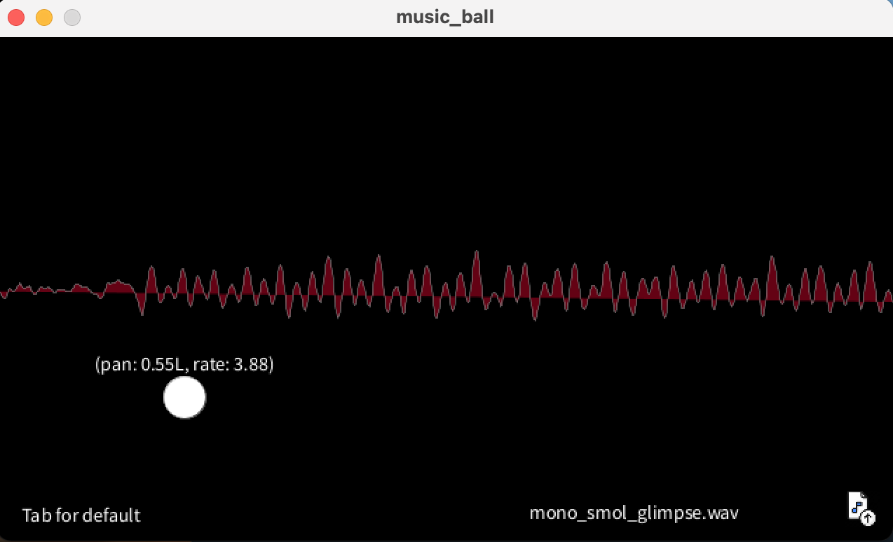

# Music Ball
This was my first [Processing](https://processing.org/) project! User can upload a mono soundfile and play with the panning & playrate of the soundfile depending on the ball's location on the screen. 
#### Software: Processing 4.0.1 (Java), Library: [Sound](https://processing.org/reference/libraries/sound/index.html)

#### To run:
1. Download [Processing](https://processing.org/download)
2. Clone this repository
3. Run the music_ball.pde sketch! :) There are some sample soundfiles included in the repo already. 

